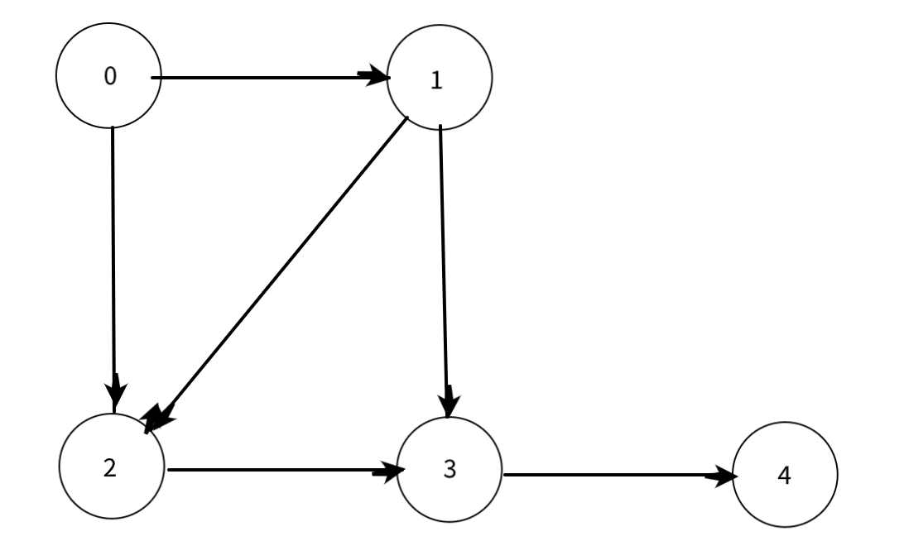

## Graduate Data Engineer (Data Platform) Challenge

### 1. Create web restful api for CRUD operation.
| Method       | URI           | Description        | 
| ------------ | ------------- | -------------------| 
| GET          | /cars/{id}    | get a specific car | 
| POST         | /cars         | create a new car   |
| PUT          | /cars/{id}    | update a specific car with payload| 
| DELETE       | /cars/{id}    | remove a specific car| 

Please provide necessary test cases for each operation.


**Assumptions:**

You can assume data in memory by using Array<class Car> to represent database. The following are the relevant code snippets:

```java
  class Car {
      private String id;
      private String brand;
      private String rego;
      private String model;
      private String createTime;
      private String updateTime;

  public Car(String id, String brand, String rego, String model) {
      this.id = id;
      this.brand = brand;
      this.rego = rego;
      this.model = model;
  }
}
```

```java
    Car[] cars = {
        new Car("0", "Toyota", "DMB-08Q", "CAMRY"),
        new Car("1", "Tesla", "MWQ-0A7", "Model-Y")
        // ......
    };
```


<br />

### 2. Find shortest path
Shortest-path problem is quite common in logistics distribution. You have been given a map of places connected by roads. Please design and implement an API endpoint to return the length of shortest path from 0 node to n-1 node.

**Assumptions:**
- The graph already exists in the memory
- It is a directed graph
- It includes m nodes (0 to n-1)
- All edges have same weight
- It starts from node 0 to node n-1
- graph[i] is a list of all the nodes connected with node i by an edge

**Example:**


Graph:

```[[1,2],[2,3],[3],[4],[]]```

Sample request:  
```
GET  /findShortestPath
```

Expected response:
```json
{
    "length": 4
}
```

(Optional bonus part) List out all possible shortest paths in the response.
Expected response:
```json
{
    "length": 4,
    "paths": [
        [0,1,3,4],
        [0,2,3,4]
    ]
}
```

### Build, test and run

#### Env
    java 1.8 
    maven 3.5.4

#### Build
    mvn clean install

#### Test
    mvn test
#### Run
    ./mvnw spring-boot:run

    curl localhost:8080/api/cars

