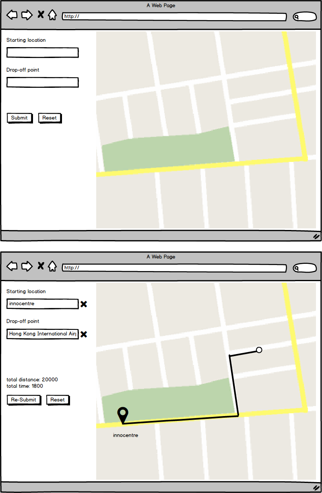

# Lalamove Software Engineer Challenge - Frontend

### Requirements
- Get pick-up location and drop-off location from user, submit them to [mockApi](https://github.com/lalamove/challenge/tree/master/mockApi)
- Display **driving route** returned by API on embedded [Google Map API](https://developers.google.com/maps/)
- Should autocomplete address
- Multi-stops is not required

- API usage should be correct
  1. `POST` `/route`: Submit pick-up point and drop-off location
  2. `GET` `/route/<TOKEN>`: Get driving route

### How to start the mockApi
Requires Node.js ver. 4+

1. Go to the mockApi folder

2. Install dependencies:
```
npm install
```

3. Run the server:
```
npm start
```

### Notes
- Source code must be stored in a git repository (you can send us a link to a github or bitbucket repo)
  - For public repos:
	  - Avoid words like `lalamove` and `challenge`.
	  - Do not copy-paste any part of this file. (task, API documentation, etc.)
	  - This is needed to prevent other candidates from finding your solution.
- Your repo should be easy to setup with clear instruction.
- (Optional) Deploy as a public site to your own host.
- (Optional) PWA
- (Optional) Mobile Responsive

### Expection
- This challange should take around 4 hours to complete.
- You can work on it at your own schedule, but a complete solution is expected within 7 days.
- Your code should be modular, each module should focus on doing one thing and do it well.
- Major functionalities should be covered by unit tests.
- Avoid over-engineering.
- Error handling and retry if backend is busy.
- Be cautious of third-party library usage. (Don't include a 300KB library only for 1 helper function)

### Recommand Tech Stack
- We switching most of our projects from jQuery to React. We aim for reusable components and maintainable codebase when expansion, but feel free to use other tech if you prefer.

### Wireframe
*For reference only, you can be creative with design and UI/UX features.*


**Questions? We love to answer: <techchallenge@lalamove.com>**
