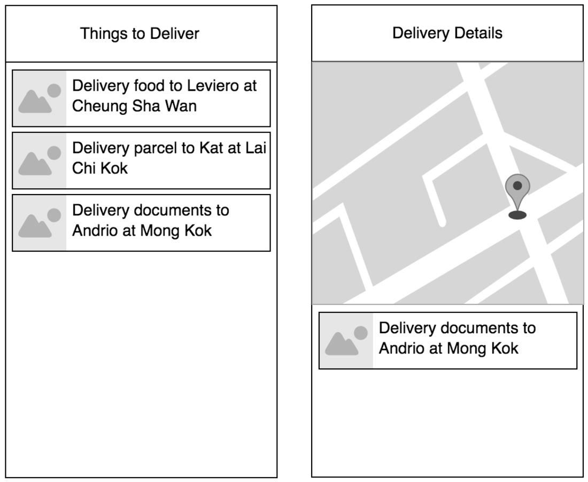

# Lalamove Mobile Developer Technical Challenge

### Business requirement
As an user I want to be able to see a list of my deliveries, including receivers photo and item description. I also want to be able to see the delivery location on the map and full description when I click on the delivery item.

### API Specification

**Get list of deliveries** (use [mock API for Mobile](mockApiMobile))
  * Method
    `GET`
  * Endpoint
    `/deliveries`
  * Parameters
    * `offset` : Starting index
  * Response example:
    `HTTP code 200`
    ```json
    [
        {
            "description": "Deliver documents to Andrio",
            "imageUrl": "https://www.what-dog.net/Images/faces2/scroll0015.jpg",
            "location": {
                "lat": 22.336093,
                "lng": 114.155288,
                "address": "Cheung Sha Wan"
            }
        }, {
            "description": "Deliver parcel to Leviero",
            "imageUrl": "http://www.memoryandjustice.org/wp-content/uploads/2017/10/impossibly-cute-puppy-8.jpg",
            "location": {
                "lat": 22.319181,
                "lng": 114.170008,
                "address": "Mong Kok"
            }
        },
        ...
    ]
    ```

### User Requirements
- Retrieve list of deliveries from the API
- Display list of deliveries.
- Show details when user select an item in the list.
- Add marker on the map based on the provided lat/lng. 

### What we expect from you?
Production ready solution that you are proud of.

## Technical Requirement
- Source code must be stored in a git repository (you can send us github or bitbucket link)
- For public repos:
	- Avoid words `lalamove` and `challenge`
	- Do not copy-paste any part of this file (task, API documentation, etc.)
	- This is needed to prevent other candidates from finding your solution
- App should cache deliveries (Cached deliveries should be available offline)
- Candidates are free to use any libraries

* ### iOS Engineer
	- Storyboard or XIB is not allowed (Create UI with code only)
	- Must write in the latest Swift version

* ### Android Engineer
	- Project must compile `./gradlew build`

## Wireframe
*For reference only, you can be creative with design and UI/UX features.*



**Questions? We love to answer: <techchallenge@lalamove.com>**
