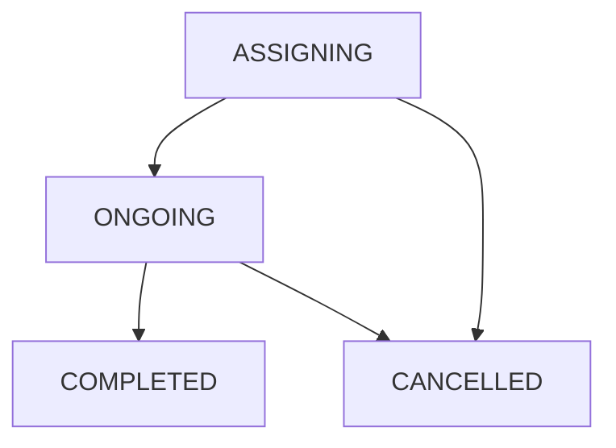

# Software Engineer in Test Challenge (API)

## Introduction

In Lalamove, our backend system is composed of a bunch of microservices. These microservices provide RESTful API for each part of the system. We need a series of automated tests to protect our APIs against bugs.

## Requirement

1. We value a **clean**, **simple** working solution.
2. You should provide some simple steps or scripts to run your tests.
3. You could choose any test framework (We prefer Node.js eg. mocha, jest, etc..)
4. Candidate must submit the project as a git repository (github.com, bitbucket.com, gitlab.com). Repository must avoid containing words `lalamove` and `challenge`.

## Problem Statement

We have APIs to process orders and require you to make sure it's functioning correctly with black box testing. The API does these tasks:
1. Place Order
2. Fetch Order Details
3. Driver to Take the Order
4. Driver to Complete the Order
5. Cancel Order

## Order Flow

An order has these statuses in sequence: `ASSIGNING` => `ONGOING` => `COMPLETED` or `CANCELLED`
   - `ASSIGNING`: looking for a driver to be assigned
   - `ONGOING`: a driver has been assigned and working on the order
   - `COMPLETED`: the driver has completed the order
   - `CANCELLED`: the order was cancelled


(in order to render the above mermaid syntax into diagram, you may install this chrome extension: https://chrome.google.com/webstore/detail/mermaid-diagrams/phfcghedmopjadpojhmmaffjmfiakfil)

## Endpoints

### Place Order endpoint
- Endpoint: /v1/orders
- HTTP verb: POST
```JSON
JSON Payload:
{
    "stops": [
        {
            "lat": 22.344674, "lng": 114.124651
        },
        {
            "lat": 22.375384, "lng": 114.182446
        },
        {
            "lat": 22.385669, "lng": 114.186962
        },
        ...
    ]
}
JSON Payload (when you want to place an advance order, set "orderAt" time in future):
{
    "orderAt": "2018-09-03T13:00:00.000Z",
    "stops": [
        {
            "lat": 22.344674, "lng": 114.124651
        },
        {
            "lat": 22.375384, "lng": 114.182446
        },
        {
            "lat": 22.385669, "lng": 114.186962
        },
        ...
    ]
}
Returns: HTTP 201
{
    "id": 1234,
    "drivingDistancesInMeters": [ 2300, 1640, ... ],
    "fare": {
        "amount": "130.00",
        "currency": "HKD"
    }
}
```
1. Return HTTP 201 (Created) with JSON body containing:
   - The order's “id”
   - The driving distances between each 2 stops, in meters. Accuracy below meters is not needed. For example, if there are 3 stops, there will be 2 driving distances.
   - Total fare of the entire trip. It is calculated based on the total trip distance. Price will be calculated based using:
     1. HKD 20 for first 2 kilometers (from 9pm ~ 5am, it will be HKD 30)
     2. After 2 kilometers, each 200-meter costs HKD 5 (from 9pm ~ 5am, it will be HKD 8)

### Fetch Order Details endpoint
- Endpoint: /v1/orders/{orderID}
- HTTP verb: GET
```JSON
JSON Payload: <Empty>
Returns: HTTP 200
{
    "id": 1234,
    "stops": [
        {
            "lat": 22.344674, "lng": 114.124651
        },
        {
            "lat": 22.375384, "lng": 114.182446
        },
        {
            "lat": 22.385669, "lng": 114.186962
        },
        ...
    ],
    "drivingDistancesInMeters": [ 2300, 1640, ... ],
    "fare": {
        "amount": "130.00",
        "currency": "HKD"
    },
    "status": "ASSIGNING",
    "createdAt": "2018-09-01T14:47:23.000Z",
    "orderAt": "2018-09-03T13:00:00.000Z"
}
```
1. Returns HTTP 200 with JSON body
2. Returns HTTP 404 if the order doesn’t exist


### Driver to Take the Order endpoint
- Endpoint: /v1/orders/{orderID}/take
- HTTP verb: PUT
```JSON
JSON Payload: <Empty>
Returns: HTTP 200
{
    "id": 1234,
    "status": "ONGOING",
    "ongoingAt": "2018-09-01T14:53:26.000Z"
}
```
1. Returns HTTP 200 with JSON body
2. Returns HTTP 404 if the order doesn’t exist
3. Return HTTP 422 with custom message if logic flow is violated


### Driver to Complete the Order endpoint
- Endpoint: /v1/orders/{orderID}/complete
- HTTP verb: PUT
```JSON
JSON Payload: <Empty>
Returns: HTTP 200
{
    "id": 1234,
    "status": "COMPLETED",
    "completedAt": "2018-09-01T14:53:26.000Z"
}
```
1. Returns HTTP 200 with JSON body
2. Returns HTTP 404 if the order doesn’t exist
3. Return HTTP 422 with custom message if logic flow is violated


### Cancel Order endpoint
- Endpoint: /v1/orders/{orderID}/cancel
- HTTP verb: PUT
```JSON
JSON Payload: <Empty>
Returns: HTTP 200
{
    "id": 1234,
    "status": "CANCELLED",
    "cancelledAt": "2018-09-01T14:53:26.000Z"
}
```
1. Returns HTTP 200 with JSON body
2. Returns HTTP 404 if the order doesn’t exist
3. Return HTTP 422 with custom message if logic flow is violated


## How to run the above API on your local machine

1. You will need to have docker installed (reference: https://docs.docker.com/install/)
2. Assuming you are under MacOS, type the following commands (It will be very similar on Linux/Unix OS(es)):
```BASH
$ docker network create lalamove-sample-api || true
$ docker rm -f lalamove-sample-api-db
$ docker run -d --net=lalamove-sample-api --name lalamove-sample-api-db lalamove/lalamove-sample-api-db:1.0
$ docker rm -f lalamove-sample-api
$ docker run -d --net=lalamove-sample-api --name lalamove-sample-api -p 51544:8000 lalamove/lalamove-sample-api:1.0
$ curl -X GET -H "Content-Type: application/json; charset=utf-8" http://localhost:51544/ping # you are successful if you get {"msg":"pong"}
{"msg":"pong"}
```
